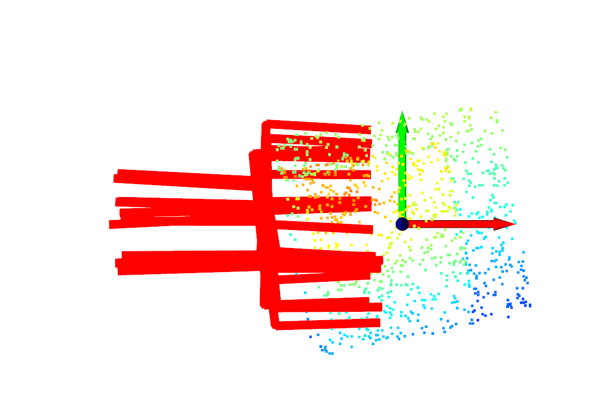
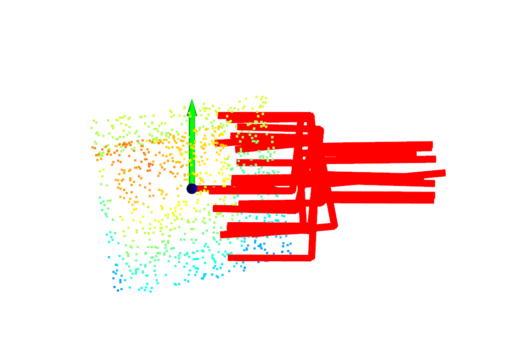
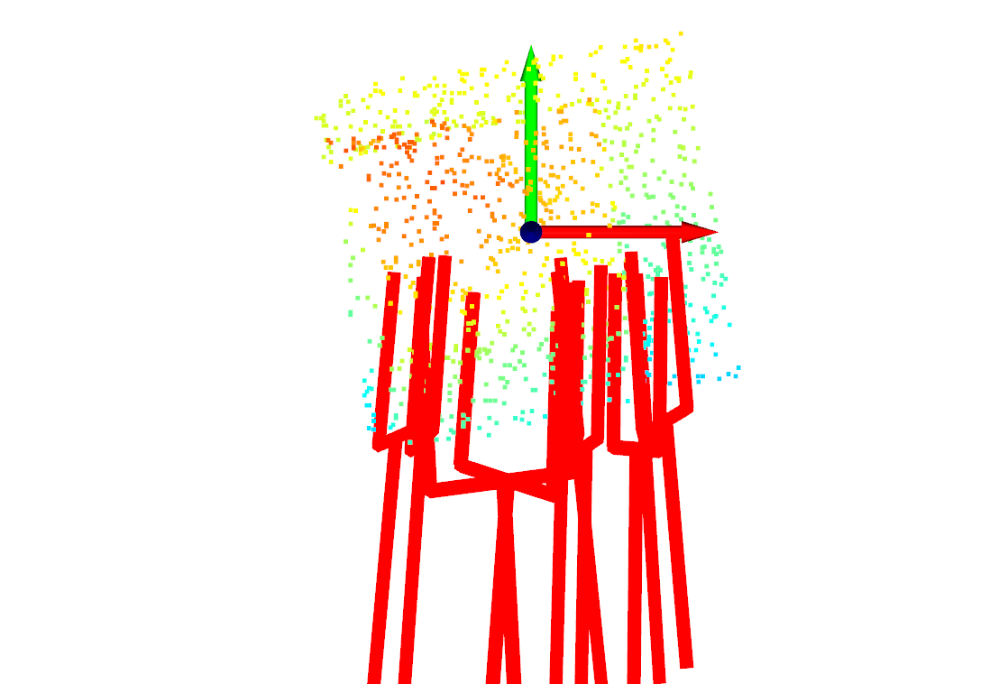
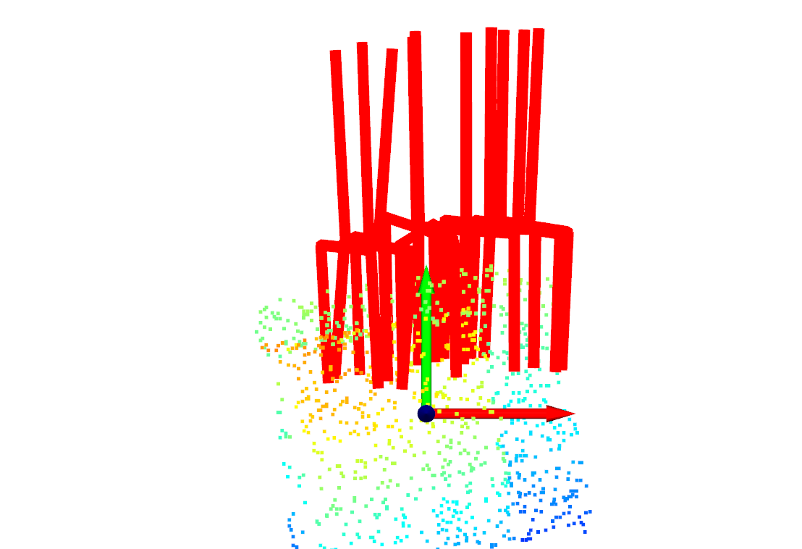
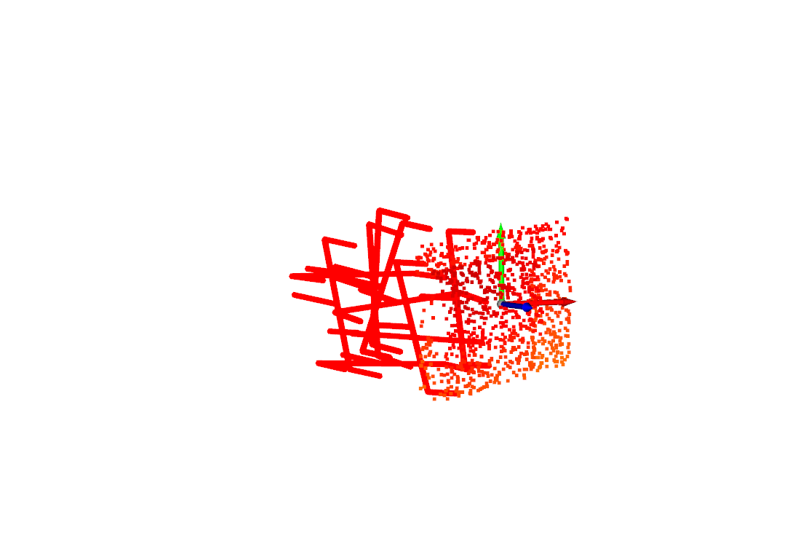
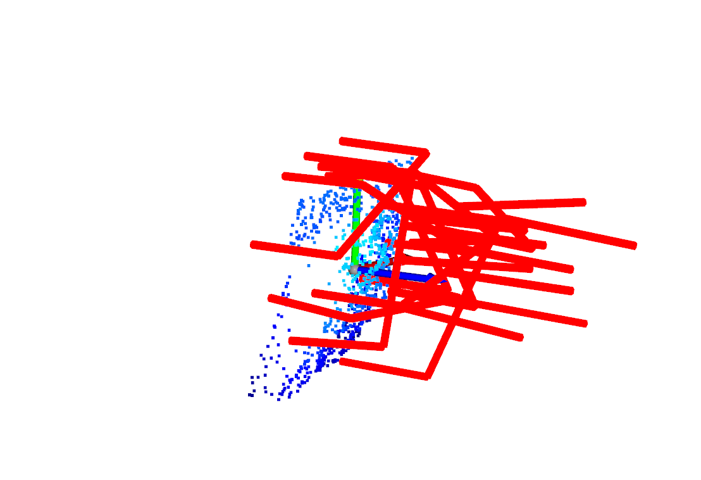

# CAPGrasp: An R3 x SO(2) Equivariant Continuous Approach-Constrained Generative Grasp Sampler

This repository contains the PyTorch implementation of CAPGrasp. We offer tools such as the CAPGrasp Sampler, Evaluator, and constrained grasp refinement, along with pre-trained models. Additionally, we provide the object set and grasp dataset essential for training.

> **Note**: The IsaacGym environment used for evaluation will be released later.

## Prerequisites

- **Operating System**: Ubuntu 18.04 (tested), Ubuntu 20 (trained model also tested)
- **Python**: 3.6
- **PyTorch**: 1.10
- **CUDA**: 10.0 (CUDA 11 has also been tested)

## Installation

To set up the environment, follow these steps:

```
git clone git@github.com:wengzehang/CAPGrasp.git
cd CAPGrasp
conda create -n capnet python=3.6
conda activate capnet
pip install --upgrade pip setuptools wheel
pip install torch==1.10.0+cu102 torchvision==0.11.0+cu102 torchaudio==0.10.0 -f https://download.pytorch.org/whl/torch_stable.html
git clone git@github.com:erikwijmans/Pointnet2_PyTorch.git
cd Pointnet2_PyTorch && pip install -r requirements.txt
cd .. && pip install -r requirements.txt 
pip install trimesh==3.14.1
# Follow instructions to download the IsaacGym package
cd isaacgym/python && pip install -e .
```

## Datasets

- **Grasp Dataset**: [Download from Google Drive](https://drive.google.com/drive/folders/1D-7twxwE-PZ1QmVei5PsCHeKXhZopMLN?usp=sharing)
- **Mesh Dataset**: [Download from Google Drive](https://drive.google.com/file/d/1BITM0ntPUNTIWthFdveoUMMblH9zaAOp/view?usp=drive_link)

## Trained Models

To access the pre-trained models, refer to the instructions in `checkpoints_2d/download_checkpoints_instruction.md`. For those interested in training their own sampler and evaluator, example commands are provided below.

## Training

### Sampler Training

Replace `$LOCALDATAPATH` with the path to the downloaded Acronym dataset.

```
python train.py \
--dataset_root_folder $LOCALDATAPATH/grasps \
--orientation_constrained \
--clusters -prpc \
--checkpoints_dir ./checkpoints_2d \
--extra_name continuous_equi_sampler \
--print_freq 4800 \
--save_latest_freq 250 \
--save_epoch_freq 1 \
--run_test_freq 1 \
--num_grasps_per_object 100 \
--num_objects_per_batch 3 \
--niter_decay 300 \
--niter 10 \
--latent_size 4 \
--gpu_ids 0,1,2 \
--equivariant
```

Monitor the training process using the Tensorboard log files stored in the `checkpoints_2d` directory.

### Evaluator Training

```
python train.py \
--dataset_root_folder /media/zehang/LaCie/zehang/ubuntu/dataset/cong_orien_grasp_full/grasps \
--arch evaluator \
--clusters -prpc \
--checkpoints_dir ./checkpoints_2d \
--extra_name shared \
--print_freq 4800 \
--save_latest_freq 250 \
--save_epoch_freq 1 \
--run_test_freq 1 \
--num_grasps_per_object 50 \
--num_objects_per_batch 4 \
--niter_decay 300 \
--niter 10 \
--gpu_ids 0
```

## Generating Refined Grasps

Utilize CAPGrasp to generate constrained, refined grasps from partially observed point clouds. The following example demonstrates loading a point cloud, centering it, sampling 200 grasps with a specified approach constraint, and refining these grasps over 20 iterations without constraint.

```
python grasp_sampler_refiner.py \
    -cfs checkpoints_2d/vae_lr_0002_bs_300_scale_1_npoints_128_radius_02_latent_size_4_position_constrained_orientation_constrained_continuous_equivariant_clusters_prerendered_continuous_equi_regloss/ \
    -cfe checkpoints_2d/evaluator_lr_0002_bs_200_scale_1_npoints_128_radius_02pointnet++_clusters_prerendered_0401 \
    --gpu_ids 0
```

Here are examples of generated grasps with six different approach constraints:

|  |  |
|:-----------------:|:-----------------:|
|     (1,0,0)       |     (-1,0,0)      |

|  |  |
|:-----------------:|:-----------------:|
|      (0,1,0)     |     (0,-1,0)       |

|  |  |
|:-----------------:|:-----------------:|
|      (0,0,1)      |     (0,0,-1)      |


## Evaluation in IsaacGym

Details coming soon.
